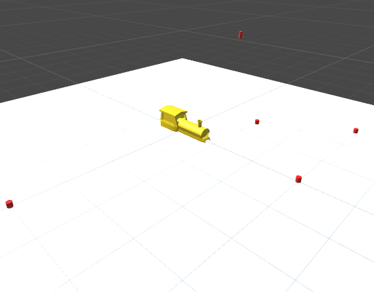

# unity1day_RomaTrain
ファーガンソンに沿って列車が走る

これは、Unity1DayChangeJamで作ったものの3D版です。

Unity1DayChangeJamはTwitter上で行われたイベント的なものです。
https://twitter.com/PonixNews/status/1006100406437437441

僕はこの2日目を担当しました。列車っぽいものを作りました。
https://twitter.com/Romast38/status/1009750209130184704

ファーガンソン曲線というCGで時々使われる自由曲線を使って路線を生成しています。
マーカー(赤い円柱)を適当な順番で配置すると、その間を補完してくれます。

ファーガンソン曲線に必要な引数は、曲線の始点と端点それぞれの位置ベクトルと速度ベクトルです。